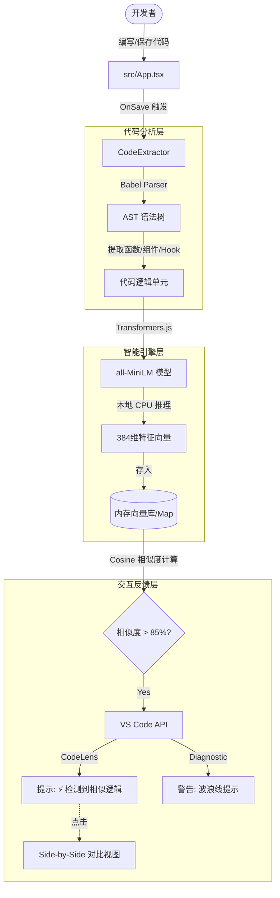

# CodeTwin

一个用于语义代码查重的 VS Code 插件,基于 AST 分析检测项目中的重复代码。

## 功能特性

- 🔍 **智能扫描**: 自动扫描工作区中的 TypeScript/JavaScript/Vue 文件
- 🌳 **AST 分析**: 使用 Babel 解析器进行精确的代码结构分析
- 🧠 **语义理解**: 使用本地 BERT 模型 (all-MiniLM-L6-v2) 将代码转换为向量
- 🤖 **查重引擎**: 基于余弦相似度 (Cosine Similarity) 检测语义重复的代码
- ⚡️ **实时反馈**:
  - **CodeLens**: 函数上方的直观提示
  - **Diagnostic**: 问题代码的波浪线警告
  - **Diff View**: 一键对比相似代码

## 技术架构

## 使用方法

1. 在 VS Code 中打开一个包含 TypeScript/React/Vue 项目的工作区
2. 插件会自动进行增量扫描
3. **手动触发**: 按 `Cmd+Shift+P` 输入 `CodeTwin: Find Duplicate Code`
4. **查看结果**:
   - 观察编辑器中的 CodeLens 提示
   - 查看 "CodeTwin" 输出通道的详细报告

## 路线图

- [x] 基础代码提取功能
- [x] 代码相似度计算 (BERT + Cosine)
- [x] 重复代码检测
- [x] 实时 UI 反馈 (CodeLens/Diagnostic)
- [x] Vue 文件支持
- [ ] 可视化 Webview 报告
- [ ] 配置选项优化

## 许可证

MIT
